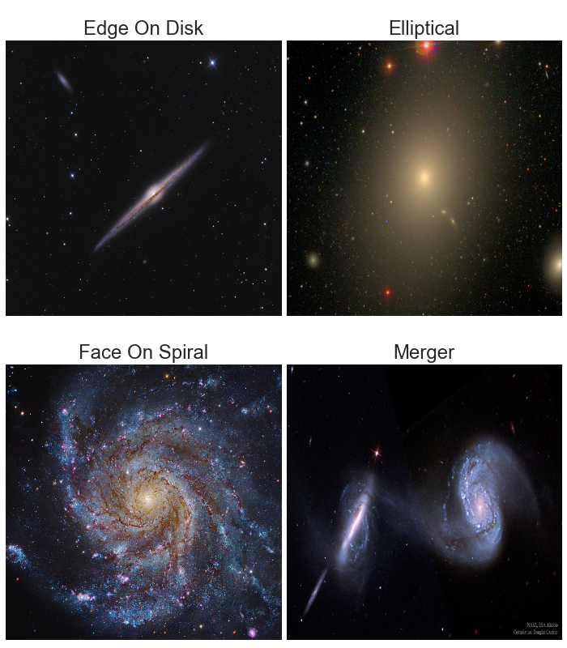
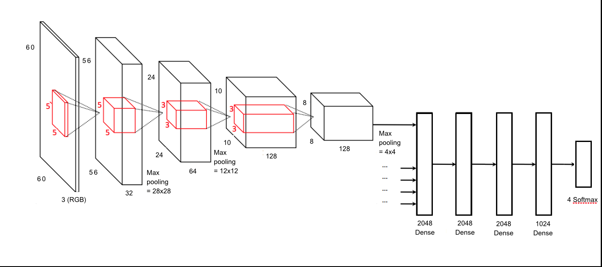
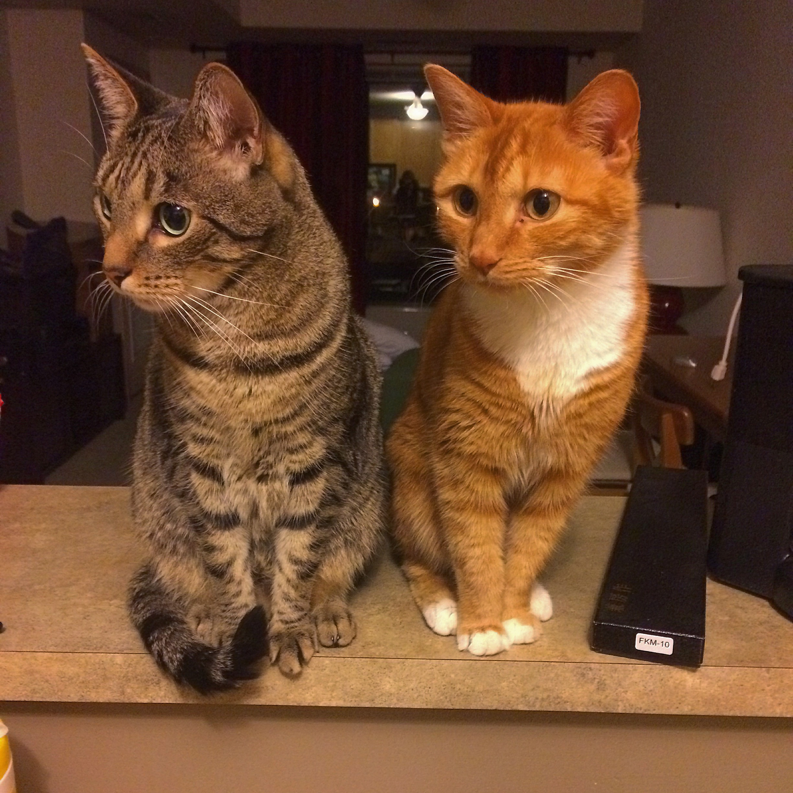

# Night Sky Net: Exploring deep space using convolutional neural networks

Classifying galaxy morphologies has long been a challenging problem in Astrophysics. Historically, galaxies were classified by hand by research scientists and graduate students. This task was scaled by using crowdsourcing using civilian scientists ([galaxy zoo project](https://www.galaxyzoo.org)) with the release of data from the first large scale sky surveys containing millions of images of galaxies.

My project implements convolutional neural networks (CNN) to learn relevant features and classify galaxies. Successful classification using CNNs is much quicker than being carried out by scientists, and likely more reliable than crowdsourcing. The increase in efficiency will allow progress to continue to scale with the data collected from increasingly powerful telescopes, and may add insight to complex and faint images that humans do not do well with classifying.

### Outline

* [Data Acquisition](#data-acquisition)
* [Data Munging and Image Pre-Processing](#data-munging-and-image-pre-processing)
* [A Note on Class Imbalance and Mergers](#a-note-on-class-imbalance-and-mergers)
* [Neural Network Architecture](#neural-network-architecture)

### Data Acquisition

I obtained coordinates, number of crowd-sourced votes, and percentage of votes for each class from the [Sloan Digital Sky Survey (SDSS) SQLServer](http://cas.sdss.org/dr8/en/tools/search/sql.asp). Using these coordinates, I scraped the SDSS catalog archive for 380,000 images of galaxies.

### Data Munging and Image Pre-Processing

Using the metadata, I chose to focus on four classes: Edge-on and Face-on spirals, Elliptical galaxies, and merging galaxies. (Edge-on vs. Face-on is not a scientifically interesting distinction, but are very visually different.)
Example images of each data type are shown below

The face-on spiral class was made by combining the clockwise and anti-clockwise spiral classes from the original dataset, while the other three classes were all distinct. I dropped the ``don't know`` and ``combined spiral`` classes as they were too ambiguous to get robust results from a classifier. Once I had distilled to these 4 classes, I re-normalized the probabilities of class membership so that they totalled to 1.

To select images for the net to train on, I chose only images with a probability of class membership >= 95%, and trained the model as a classifier. (see [code](https://github.com/TarynHeilman/DSI-Capstone-Project/blob/master/scripts/clean_metadata.py)) Later, I will predict probabilities of class membership using this net on images with lower certainty from the human classifications, and compare this with the human-generated probabilities.

All images downloaded from the SDSS catalog archive were 120x120 pixels. Each image was randomly subjected to a rotation, flipping horizontally or vertically, or transposed. The modified images were then randomly translated by a few pixels and cropped to 60 x 60 image for feeding into the net. (see code [here](https://github.com/TarynHeilman/DSI-Capstone-Project/blob/master/scripts/image_transformations.py) and [here](https://github.com/TarynHeilman/DSI-Capstone-Project/blob/master/scripts/data_cleaning.py) )

### A Note on Class Imbalance and Mergers

After the strict assignment of images to classes, there were 14,275 images remaining. These were split into training and test sets with 80% and 20% of the samples, respectively. Of the over 14,000 images, only 42 of those were classified as mergers. Even without the class imbalance, mergers are tricky to classify because they are generally a combination of one or more of the other three classes and do not have any unique distinct features.

In order to make the neural network more robust, multiple versions of each image with different modifications were used in the training set. The number of multiples made of each image was determined partially by the proportions of each class. Conventional wisdom tells you to train on balanced classes so that the model learns to recognize the minority class, however, in neural nets, this can often lead to overprediction of the minority class in representative testing sets. Choosing the correct amount of upsampling of the minority class for the training set was very tricky, and I am still tuning this!

After augmentation, the neural network was trained on approximately 105,000 images, about 1% of which were mergers, with the remaining split evenly between the remaining three classes.

### Neural Network Architecture

The neural network was designed using the [keras](keras.io) library for python, which is built on [theano](https://github.com/Theano/Theano). A schematic is pictured below.

The network consists of 4 convolutional layers, with depths 32, 64, 64, and 128 respectively. Max Pooling layers of dimensions (2,2) were applied after the first, second, and fourth convolutional layers.

The inputs were then flattened and fed through 4 fully connected layers. Layers 1 and 4 were dense layers with relu activations, while layers 2 and 3 were MaxoutDense layers. Each fully connected layer trained with a dropout of 0.5.

The output layer consisted of 4 softmax nodes.

For more information, see the script [CNN.py](https://github.com/TarynHeilman/DSI-Capstone-Project/blob/master/scripts/data_cleaning.py).
I am unable to load the trained model to github due to size restrictions, but if you would like to know more, contact me!

### Acknowledgements

A great thank you to all of the instructors and my fellow classmates at Galvanize, whose assistance throughout this class and with this project has been invaluable, and whom I drew inspiration from each and every day.

References that gave me jumping off points:
[Andrej Karpathy Neural Networks Lectures](https://www.youtube.com/watch?v=gYpoJMlgyXA)

[Dieleman, S. et al. 2014](http://arxiv.org/pdf/1503.07077.pdf)

Lastly, a thank you to my coding supervisors, who stayed up with me until the wee hours of the morning helping me get the job done. (Pictured below)

